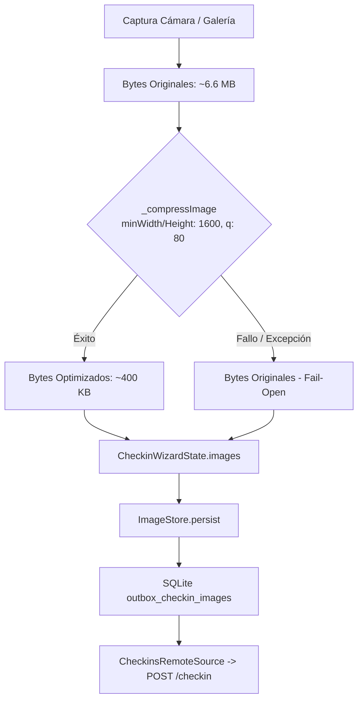

# Pipeline de Procesamiento y Compresión de Imágenes

Documentación técnica del pipeline de compresión y reducción de resolución de imágenes en `rayuela-mobile` y su integración con el backend.

---

## 1. Motivación y Contexto

Los voluntarios de Rayuela realizan observaciones en campo (reservas naturales, costas, parques), donde la conectividad celular es limitada, costosa o inestable.

Las cámaras de smartphones modernos capturan fotos a resoluciones masivas ($12\text{ a }48\text{ MP}+$), generando archivos de **$3\text{ a }15\text{ MB}+$ cada una**. Subir 3 fotos crudas en un check-in implicaba:
- Transferir entre **$10\text{ y }45\text{ MB}$** por reporte en la red móvil.
- Alto riesgo de timeout (límite de 90s) y fallos en subida.
- Saturación del almacenamiento local (`ImageStore` en sandbox) mientras los check-ins esperan en el Outbox.
- Consumo excesivo e innecesario de almacenamiento de objetos S3 en el backend.

---

## 2. Resultados Empíricos (Antes vs. Después)

En pruebas de integración sobre emulador Android (Pixel 8 API 33) contra el backend y Garage S3 local, se procesó una fotografía de prueba de alta resolución ($6.6\text{ MB}$):

| Métrica | Foto original del dispositivo | Almacenada en Garage S3 | Impacto |
| :--- | :--- | :--- | :--- |
| **Tamaño de archivo** | **6,605 KB (6.6 MB)** | **398.46 KB** | **-94%** de reducción |
| **Resolución máxima** | Resolución nativa ($4000\times3000$+ px) | **$1600\times1000$ px** | Reducción proporcional |
| **Formato y Calidad** | JPEG / HEIC crudo (100%) | **JPEG (Calidad 80)** | Metadata EXIF limpiada |
| **Ruta en Garage** | Cache temporal de cámara | `checkins/<userId>/<uuid>.jpg` | S3 bucket `rayuela-checkins` |

> **Conclusión:** Se reduce el tráfico de datos y almacenamiento en un **94%**, manteniendo la fidelidad visual y nitidez requerida para validación científica y visualización en web/mobile.

---

## 3. Arquitectura en Rayuela Mobile

### Componentes Involucrados:
1. **`CheckinWizardController`** (`lib/features/checkin/presentation/providers/checkin_wizard_controller.dart`):
   - Inyecta `ImageCompressor` (vía `imageCompressorProvider`).
   - Al capturar desde cámara (`takePhoto()`) o seleccionar de galería (`pickImagesFromGallery()`), pasa los bytes crudos por `_compressImage()`.
   - Si la compresión arroja cualquier excepción, se atrapa con `try / catch` y se retornan los bytes originales (**fail-open**).
2. **`ImageStore` & `FlutterImageCompressorImpl`** (`lib/core/storage/image_store.dart`):
   - Utiliza `flutter_image_compress` bajo la interfaz `ImageCompressor`.
   - Parámetros: `minWidth: 1600`, `minHeight: 1600`, `quality: 80`, formato JPEG.
   - Implementa fail-open en `compressToJpeg()`: ante error de códec, retorna los bytes de entrada intactos.
3. **`core_providers.dart`** (`lib/shared/providers/core_providers.dart`):
   - Expone `imageCompressorProvider` como `Provider<ImageCompressor>`, facilitando el testing unitario con mocks y fakes.

---

## 4. Filosofía Fail-Open (Tolerancia a Fallos)

> **Regla de oro:** La funcionalidad del usuario voluntario nunca debe bloquearse ni fallar debido a un error de compresión.

Si por algún motivo (formato de imagen no estándar, memoria insuficiente en dispositivo antiguo, error interno del códec nativo de Android/iOS):
- El error se registra en log con nivel `warning`.
- El flujo continúa sin interrupciones guardando y enviando los bytes originales sin comprimir.
- El voluntario completa su check-in normalmente.

El backend NestJS también cuenta con su propia etapa de normalización con `sharp` protegida con fail-open antes de subir a Garage S3, garantizando doble capa de seguridad.
