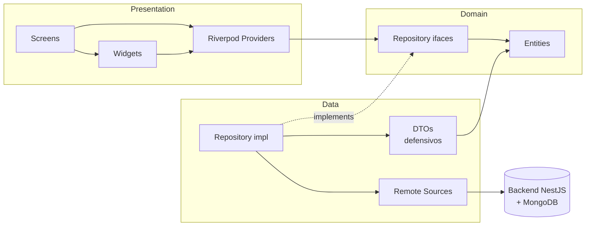
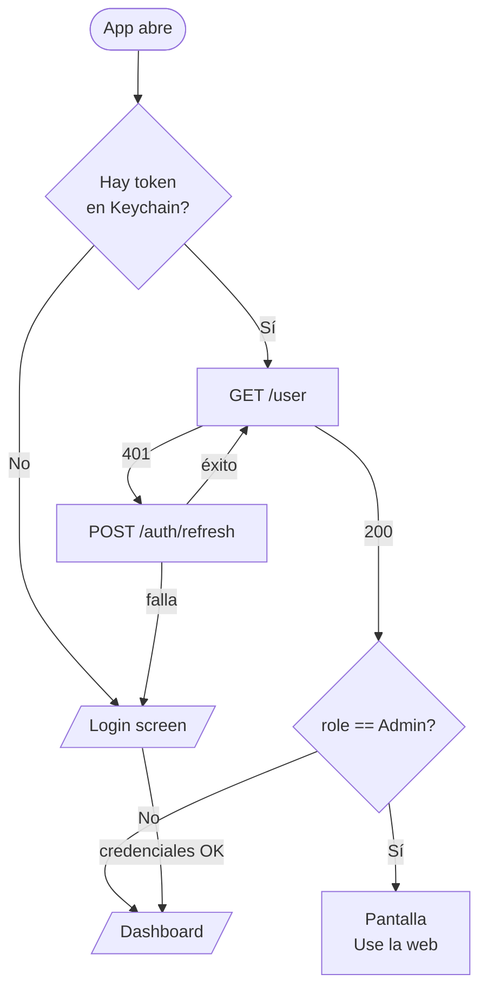
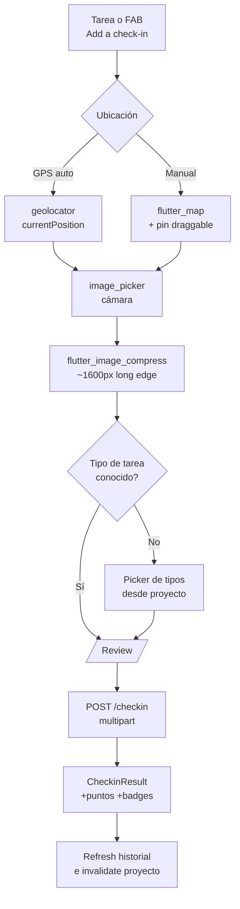
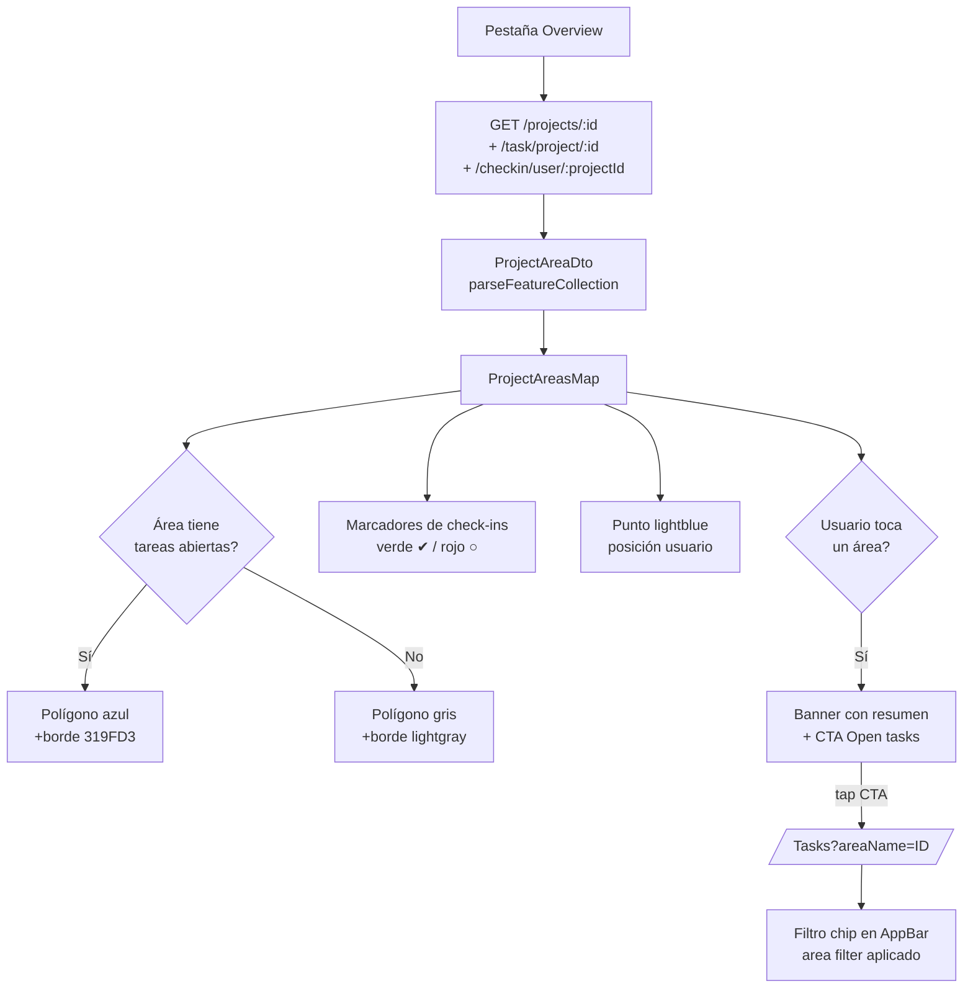

# Migración de Rayuela a Mobile — Resumen y decisiones de diseño

Este documento cuenta cómo se migró la experiencia del voluntario de la web (Vue 3 + Vuetify + OpenLayers) a una aplicación móvil nativa multiplataforma (Flutter), por qué se tomó cada decisión técnica, y por qué creemos que el salto a mobile mejora sustancialmente el bucle de gamificación adaptativa de Rayuela.

> El plan original, en inglés y mucho más extenso, está en [`MIGRATION_PLAN.md`](./MIGRATION_PLAN.md). Este archivo es un compañero en español, centrado en lo que se construyó y por qué.

---

## 1. Contexto: qué es Rayuela y qué cambia con mobile

Rayuela es una plataforma de ciencia ciudadana con gamificación adaptativa. ONG e investigadores definen proyectos sobre áreas geográficas (polígonos GeoJSON), tareas con ventanas temporales, tipos de tarea, y reglas de gamificación (badges + puntos). Los voluntarios se suscriben al proyecto, salen al campo y envían "check-ins" con coordenadas, fecha y hasta tres fotos. El backend ejecuta un motor de juego configurable (`gamificationStrategy`, `recommendationStrategy`, `leaderboardStrategy`) que devuelve puntos, medallas desbloqueadas y posición en la tabla, y guarda calificaciones para alimentar el recomendador adaptativo.

La aplicación web original es estupenda como consola — muy completa, con dibujado de polígonos, edición de reglas, generación masiva de tareas, configuración fina del motor de gamificación. Pero ese mismo nivel de detalle es ruido para el voluntario, que en realidad solo quiere abrir la app desde la calle, ver qué hay cerca, y registrar su contribución. La hipótesis de la migración es que **la fricción del voluntario es la métrica que define el éxito del sistema**: cuanto más corto sea el bucle "abrir → ver tarea → registrar → recompensa", más check-ins habrá, más rica la señal para el motor adaptativo, y más se afianza el hábito de juego.

La app mobile que se ha construido se enfoca exclusivamente en el rol de voluntario. La consola admin (`/admin/*`) se queda en la web por diseño: ni los flujos ni el cuidado visual están pensados para una pantalla de teléfono, y replicarla nos haría perder foco.

---

## 2. Por qué mobile mejora la gamificación de Rayuela

La gamificación adaptativa de Rayuela depende de tres palancas que en una web responsive se debilitan, y que en mobile recuperan toda su potencia.

**Geolocalización en el bolsillo.** Un check-in es, por definición, un acto en el mundo físico. En la web el voluntario tiene que recordar dónde estuvo, abrir el mapa al volver a casa, ubicar el punto a mano y subir la foto desde la galería. En mobile la app accede al GPS con `geolocator`, calcula la posición real con `LocationAccuracy.high`, y la cámara nativa entrega una foto recién tomada con metadatos consistentes. La calidad de la señal que entra al motor mejora — coordenadas reales, no aproximaciones — y eso hace que el `recommendationStrategy: ADAPTIVE` (similitud por área/horario/tipo) ranquee tareas con datos más limpios.

**Ciclo de retroalimentación corto.** El motor adaptativo gana cuando puede observar muchos micro-eventos seguidos. La web obliga a una sesión sentada delante del computador; mobile permite sesiones de 60–90 segundos en la calle. Eso multiplica el número de check-ins por usuario por mes, y por tanto la cantidad de puntos en la matriz Dice del recomendador, lo que afina la sugerencia de la siguiente tarea. La estrategia `ELASTIC` (turbo-mode para usuarios rezagados) también se beneficia: el voluntario recibe el "boost" en el momento de oportunidad real, no días después.

**Notificaciones como motor de retención.** Sin push, el motor de gamificación es ciego: puede otorgar una medalla, pero el usuario tarda días en enterarse. Con FCM/APNs (planeado en fase 2, ya con espacio reservado en el `ApiClient` y en el backend) la app puede empujar `badge_unlocked`, `leaderboard_moved` o `recommendation_ready` al instante. La medalla se ve en pocos segundos, y el reconocimiento social (subir tres puestos en la tabla) se convierte en un evento, no en un hallazgo.

**Tablero de líderes más vivo.** En mobile el leaderboard tiene una cabecera fija con la posición personal y se desplaza con paginación. En cada tab del proyecto el voluntario sabe exactamente qué le separa del siguiente puesto; eso es justamente lo que la estrategia `BADGES_FIRST` o `POINTS_FIRST` quiere comunicar.

En conjunto: lo que en la web era una herramienta de consulta, en mobile se convierte en un compañero de campo. Esa es, en una frase, la razón por la cual el cambio importa.

---

## 3. Stack y decisiones tecnológicas

La elección de tecnologías partió de tres requisitos: que el código sea **uno solo** para Android e iOS, que el ciclo de iteración sea rápido, y que el contrato con el backend NestJS no se ensucie con magia mágica de generación. De ahí surgen las decisiones siguientes.

**Flutter + Dart 3.6 con Material 3.** Flutter ofrece la mejor relación entre productividad y rendimiento real: el render se hace con Skia/Impeller, así que las animaciones de la pantalla de recompensa se sienten nativas; el lenguaje (Dart) tiene null-safety estricta; y la base de widgets es lo suficientemente moderna para no luchar contra el framework. Material 3 nos da tokens de color, tipografía y elevación coherentes, así que cualquier pantalla nueva entra al estilo Rayuela sin tener que repintar a mano.

**Riverpod 2.5 para estado y dependencias.** Sobre Provider clásico ganamos `family` y `autoDispose`, que mapean limpiamente al patrón "un proyecto, un futuro". `FutureProvider.autoDispose.family<ProjectDetail, String>` es exactamente lo que la pantalla de proyecto necesita: se cancela al salir, se resetea con `ref.invalidate`, y combina con el `RefreshIndicator` sin código adicional. Riverpod también permite sobreescribir providers en tests sin tener que envolver la app en mocks frágiles.

**go_router 14 con redirección consciente de la sesión.** El router lee el `AuthState` y decide a dónde mandar al usuario en cada cambio: si el token desaparece, cualquier ruta protegida cae en `/login`; si el rol es `Admin`, se muestra una pantalla cortés ("usá la consola web") en vez de bloquearlo en silencio. Las rutas son nombradas (`AppRoute.tasks`), lo que permite navegar pasando `pathParameters` y `queryParameters` tipados — fundamental para el filtro por área (`?areaName=...`).

**Dio 5 con interceptores tipados.** El backend devuelve estructuras consistentes pero con mucha tolerancia (campos opcionales, herencia de `_id` vs `id`). Dio nos da hooks para inyectar `Authorization`, hacer refresh on-the-fly cuando llegue 401, redactar headers sensibles en logs, y mapear cualquier `DioException` a una jerarquía propia (`NetworkException`, `UnauthorizedException`, `ServerException`, `ValidationException`). Esa jerarquía es la que llega a la UI: el widget `ErrorView` hace pattern-matching y muestra un mensaje útil ("Sin conexión", "El servidor no respondió", "Faltan campos") en lugar del stacktrace de Dio.

**flutter_secure_storage para tokens, shared_preferences para preferencias.** El access token y el refresh token van al Keychain en iOS y al Keystore en Android. Las preferencias triviales (idioma, ajustes de filtros) usan `shared_preferences` porque no merecen el coste de cifrado.

**flutter_map + OpenStreetMap para los mapas.** Se descartó Google Maps porque (a) introduce dependencias propietarias, claves y costes a futuro; (b) la web ya usa OpenLayers + OSM, y mantener la coherencia visual entre admin y mobile importa; (c) `flutter_map` es lo suficientemente flexible para dibujar polígonos GeoJSON, marcadores y capas custom. La librería `latlong2` aporta el tipo `LatLng` y los `LatLngBounds` que el `MapController.fitCamera` necesita.

**geolocator + permission_handler para ubicación, image_picker + flutter_image_compress para fotos.** Pares estándar: el primero pide permisos y entrega `Position`, el segundo abre la cámara nativa y comprime a un eje largo de ~1600 px antes de subir, lo que recorta enormemente el ancho de banda y respeta el límite de 5 MB que el backend va a imponer en la fase 2.

**DTOs hechos a mano en lugar de freezed/json_serializable.** Se evaluó introducir `freezed`, pero por ahora cada feature tiene su `*_dto.dart` con un constructor `fromJson` defensivo escrito a mano. La razón: el backend devuelve algunos campos con dos o tres alias (`_id`/`id`, `image`/`imageUrl`, `areaName`/`area`/`areaGeoJSON.properties.id`), y a veces números como string y booleanos como `0/1`. Un parser hecho a mano deja claro cuál es la prioridad de fallback y se documenta junto al código. Cuando el backend estabilice los campos haremos la migración a `freezed`, pero por ahora "tener control sobre cada parseo" valió más que "menos líneas".

**Tests con mocktail.** Cada DTO tiene su test (`test/features/<area>/<dto>_test.dart`). El cliente HTTP se cubre con `mocktail` para simular fallos de Dio y verificar la traducción a `AppException`. El criterio: si una funcionalidad va a tocar JSON del backend, tiene que tener un test que congele el contrato visto en producción.

---

## 4. Arquitectura

La aplicación se estructura por **feature**, y cada feature respeta una clean architecture mínima de tres capas: `data`, `domain`, `presentation`. Esto significa que cualquier widget solo importa entidades del dominio y providers de la feature; la UI nunca ve `DioException`, ni un `Map<String, dynamic>`, ni un DTO. La presentación habla con providers; los providers usan repositorios; los repositorios mapean DTOs a entidades; los DTOs son el único lugar donde se conoce la forma de los JSON del backend.



Cada flecha sólida es una dependencia real en código; las punteadas son contratos. El detalle clave es que **el dominio no depende de nada externo**: ni de Dio, ni de Flutter, ni del JSON. Esto permite que las entidades (`ProjectDetail`, `TaskItem`, `CheckinResult`, `LeaderboardEntry`) sean razonables en tests unitarios sin levantar el framework.

La organización de carpetas refleja esa misma lógica:

```
lib/
  core/                  Cliente HTTP, almacenamiento, router, tema
  features/
    auth/                Login, registro, splash (sesión + token)
    dashboard/           Lista de proyectos suscritos + detalle del proyecto
    tasks/               Listado de tareas + filtro por área
    checkin/             Captura, mapa, fotos, resultado, historial
    leaderboard/         Tabla de líderes por proyecto
  shared/                Widgets transversales (ErrorView, EmptyState…)
```

Dentro de cada feature reaparecen las mismas tres carpetas (`data/`, `domain/`, `presentation/`). Esto hace que un desarrollador nuevo aprenda **una vez** el layout y lo aplique después a cualquier área del código. Es deliberadamente repetitivo.

### 4.1 Capa core

`core/network/api_client.dart` envuelve a Dio. Cada llamada pasa por el `AuthInterceptor` (añade `Authorization: Bearer ...` desde el `SecureTokenStore`), por el `RefreshInterceptor` (intenta `POST /auth/refresh` cuando ve 401) y por un mapeador de errores que convierte cualquier `DioException` en una de las cinco subclases de `AppException`. Las llamadas devuelven `Future<Result<T>>` (`Success(T)` o `Failure(AppException)`), así que la capa de repositorios nunca lanza excepciones a la presentación.

`core/router/app_router.dart` define rutas tipadas (`AppRoute.dashboard`, `AppRoute.tasks`…) y un `redirect` que lee el `authControllerProvider` y decide a dónde llevar al usuario en cada transición.

`core/theme/app_theme.dart` aplica la paleta de Rayuela sobre `ColorScheme.fromSeed`, así que cualquier `theme.colorScheme.primary` o `theme.textTheme.titleSmall` que use un widget hereda los colores correctos sin hardcodear valores.

### 4.2 Las features que ya están en producción

La feature de **autenticación** cubre splash, login y registro contra el backend real (`POST /auth/login`, `POST /auth/register`, `GET /user`). El estado de sesión vive en `authControllerProvider` (un `Notifier<AuthState>`); el splash decide entre `/login` y `/dashboard` según haya token o no, y los admins son interceptados por la pantalla "Use la consola web".

La feature de **dashboard** llama a `GET /volunteer/projects` y muestra los proyectos suscritos con su overlay de usuario (puntos, medallas conseguidas). Tocar un proyecto abre el detalle, que hace `GET /projects/:id` y se reorganiza en tres pestañas (`Overview`, `Check-ins`, `Progress`) si el usuario está suscrito, o muestra un único panel con el botón "Subscribe" si no lo está. La pestaña Overview incluye el **mapa de áreas del proyecto** (descrito a fondo en la sección siguiente) y un grafo lineal de medallas con dependencias, equivalente reducido al DAG SVG de la web.

La feature de **tasks** consume `GET /task/project/:id` y lista las tareas en dos secciones (Open / Solved), cada una con su `TaskCard`. Soporta un parámetro de ruta opcional `?areaName=...` para filtrar las tareas de un área concreta — el filtro se ve como un `InputChip` en el AppBar y se puede limpiar inline.

La feature de **checkin** es la más rica. Tiene captura con GPS (con un selector manual de ubicación basado en `flutter_map`), cámara nativa con compresión, formulario progresivo (where → what → photos → review), pantalla de resultado que muestra puntos y medallas obtenidas, y vista de historial (`GET /checkin/user/:projectId`). El historial admite imagen ampliada con `cached_network_image` y el dominio del checkin distingue tres estados: con contribución a tarea, sin contribución, y solo georeferenciado.

La feature de **leaderboard** llama a `GET /leaderboard/:projectId`, ordena por puntos (o por medallas según `leaderboardStrategy`) y resalta al usuario actual con un `Container` distinto. Vive embebida en la pestaña de progreso del proyecto, no como una pantalla suelta.

---

## 5. Flujos clave

Tres flujos definen la experiencia. Conocerlos bien ayuda a leer el código.

### 5.1 Inicio y sesión



El detalle interesante: el `AuthListenable` puente entre Riverpod y go_router hace que cualquier cambio en `authControllerProvider` re-evalúe el redirect. Cuando el `RefreshInterceptor` invalida la sesión por un refresh fallido, el router automáticamente lleva al usuario a `/login` sin que ningún screen tenga que enterarse.

### 5.2 Check-in en el campo (el corazón del producto)



Cada paso del check-in tiene una decisión detrás. El permiso de ubicación se pide tarde, no en el splash, para que el primer permiso del usuario coincida con su intención. La cámara siempre tiene preferencia sobre la galería: la idea es que el check-in refleje lo que el voluntario está viendo *ahora*. La compresión es agresiva pero todavía guarda un eje largo suficiente para reconocimiento visual. Y en la pantalla de resultado, además de mostrar puntos y medallas, se invalida el provider del proyecto y del historial — así, cuando el usuario vuelva a la pantalla anterior, la tabla de líderes y el contador de medallas ya están actualizados.

### 5.3 Mapa de áreas y filtro de tareas (el último incremento)

Esta fue la última pieza del slice de áreas. El proyecto guarda sus áreas como un `FeatureCollection` GeoJSON (`project.areas`); cada `Feature` tiene `geometry.type` ∈ {`Polygon`, `MultiPolygon`}, coordenadas en orden `[lon, lat]`, y un `properties.id` que sirve a la vez como nombre legible y como clave de unión contra `task.areaGeoJSON.properties.id`. Esa misma clave se usa para emparejar tareas a áreas y poder colorear cada polígono según haya o no tareas pendientes.



Los colores replican exactamente los que usa la web (`createAreaStyle` en `views/Admin/GeoMap.vue`): azul `rgba(0,0,255,0.30)` con borde `#319FD3` para áreas con tareas, gris `rgba(128,128,128,0.5)` con borde `lightgray` para las que no. Los glifos de check-in también coinciden: tilde verde para los que solucionaron una tarea, círculo rojo hueco para los georeferenciados sin contribución. Esta paridad visual no es coquetería — sirve para que un voluntario que ya conoce la web reconozca de inmediato lo que está viendo.

El "tap-to-filter" se implementó con un ray-cast (algoritmo de paridad de cruces) sobre cada anillo, porque `flutter_map 7` no expone picking de features. Cuando el `_pointInRing` da positivo se abre un banner con el nombre del área, el resumen de tareas pendientes y un botón que navega a `Tasks` con `?areaName=...`. Allí el filtro se aplica en el `_applyFilter` del estado del screen, y el usuario puede limpiarlo con un solo tap en el chip del AppBar.

Las tareas que no tienen `areaName` (proyectos legacy) **se descartan** de las vistas filtradas en lugar de mostrarse "huérfanas". Mostrarlas bajo la etiqueta "Área X" sería engañoso; mejor decir explícitamente "esta área no tiene tareas".

---

## 6. Testing

Cada DTO crítico tiene su archivo de tests. Los más relevantes son:

- `test/features/dashboard/project_detail_dto_test.dart` cubre la fusión de catálogo de medallas con overlay de usuario, los alias `_id`/`id`, los strings sueltos en `badgesRules`, la coerción de `active: 1/0`, el flujo de `taskTypes` como objetos, y el end-to-end de áreas → entidad.
- `test/features/dashboard/project_area_dto_test.dart` cubre Polygon, MultiPolygon, drop de holes, lista de Features sin wrapper, drop de geometrías no soportadas, coerción de coordenadas como strings, y robustez ante payloads basura.
- `test/features/tasks/task_dto_test.dart` cubre la cadena de fallback de `areaName` (`areaName` → `area` → `areaGeoJSON.properties.id`).
- `test/features/checkin/checkin_dtos_test.dart` y `checkin_history_dto_test.dart` cubren parseo de check-ins con y sin contribución a tarea, y el wire shape de `imageRefs[]`.
- `test/features/auth/auth_dtos_test.dart` cubre login y `GET /user`.
- `test/features/leaderboard/leaderboard_dto_test.dart` cubre orden por puntos y por medallas.
- `test/core/network/api_client_error_mapping_test.dart` simula con `mocktail` los errores de Dio y verifica que cada uno se traduzca al `AppException` correcto.

El criterio para escribir un test es estrecho a propósito: **si el formato de un JSON cambia y nadie lo nota, ¿qué se rompe?** Si la respuesta es "una pantalla queda vacía", ese DTO necesita un test que congele el contrato.

---

## 7. Lo que queda fuera (a propósito)

Algunas cosas se quedaron deliberadamente fuera del alcance, porque no pertenecen al rol del voluntario o porque agregarían complejidad sin retorno claro en esta etapa. La consola admin completa (`/admin/*`), incluyendo dibujado de polígonos, edición de reglas de medallas y generación masiva de tareas, vive y vivirá en la web. El grafo SVG completo de dependencias entre medallas se sustituye por una lista lineal "qué desbloqueas a continuación" con un bottom sheet para ver requisitos completos — más legible en pantalla pequeña. El soporte offline para check-ins (cola en SQLite con `Idempotency-Key`) está reservado para la fase 2, junto con FCM/APNs y la edición de perfil. La paginación y búsqueda en el catálogo público de proyectos también se posterga: con el volumen actual no se justifica.

---

## 8. Próximos pasos

La fase 1 (MVP que ya está en repo) deja la app utilizable de punta a punta en happy-path: login, dashboard, detalle de proyecto con mapa y tabs, tareas con filtro por área, check-in con cámara y GPS, historial de check-ins, leaderboard. Las siguientes fases son crecimiento, no fundación.

La **fase 2** se centra en retención: integrar Firebase Cloud Messaging y APNs con registro de dispositivos, deep links de notificación, prompt de calificación tras cada check-in (alimenta el recomendador adaptativo), cola offline con `sqflite` e `Idempotency-Key`, edición de perfil con subida de avatar a S3, paginación + búsqueda en proyectos públicos, y un pase de accesibilidad (escalado de fuente, lectores de pantalla, contraste).

La **fase 3** es pulido y crecimiento: leaderboard en vivo via SSE, coach-marks para el modo turbo (`ELASTIC`), publicación en App Store y Play Store, reporte de crashes (Sentry o Crashlytics), feature flags y A/B testing sobre la copy de las recomendaciones y las animaciones de recompensa.

---

## Apéndice — Mapeo de endpoints usados

| Endpoint | Pantalla mobile |
|---|---|
| `POST /auth/login` | LoginScreen |
| `POST /auth/register` | RegisterScreen |
| `GET /user` | SplashScreen, perfil (futuro) |
| `GET /volunteer/projects` | DashboardScreen |
| `GET /projects/:id` | ProjectDetailScreen |
| `POST /volunteer/subscription/:id` | ProjectDetailScreen (CTA Subscribe) |
| `GET /task/project/:id` | TasksScreen + ProjectAreasMap |
| `POST /checkin` (multipart) | CheckinScreen |
| `GET /checkin/user/:projectId` | UserCheckinsView + ProjectAreasMap |
| `GET /leaderboard/:projectId` | LeaderboardView |
| `GET /storage/file?key=...` | Imagen de checkin / medalla |
| `POST /auth/refresh` *(planeado)* | RefreshInterceptor |
| `POST /user/devices` *(planeado, fase 2)* | Bootstrap post-login |
