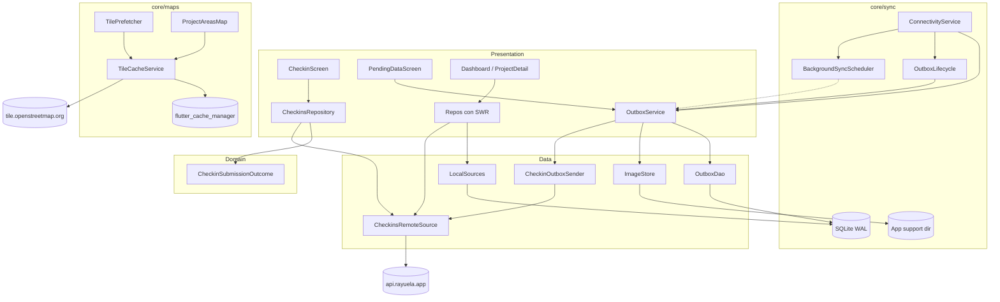
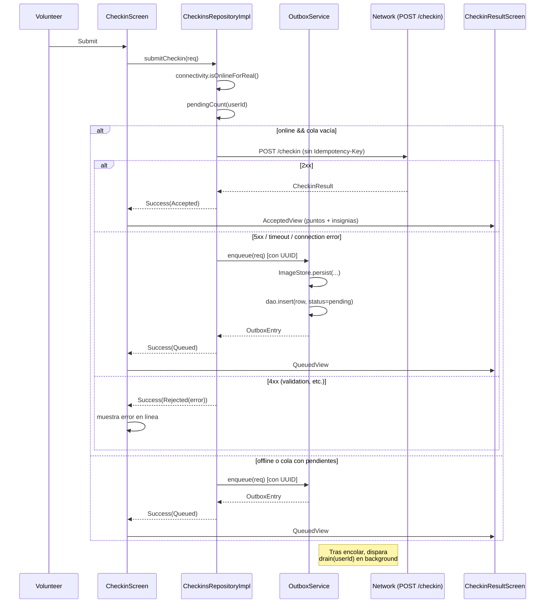
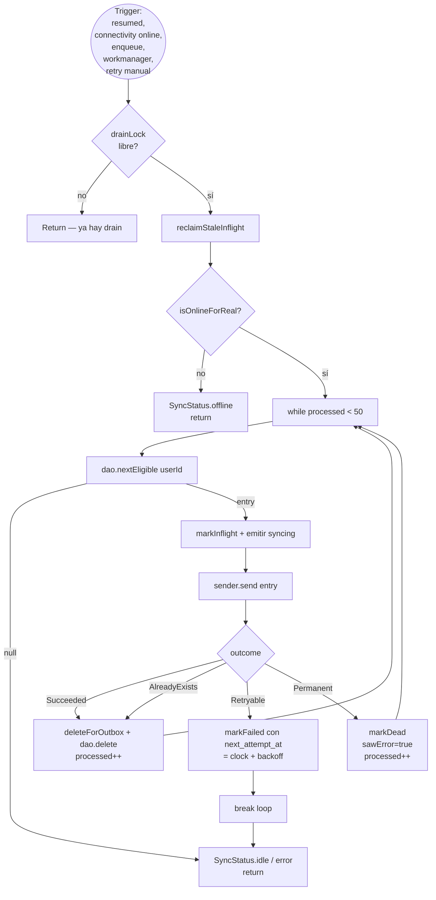
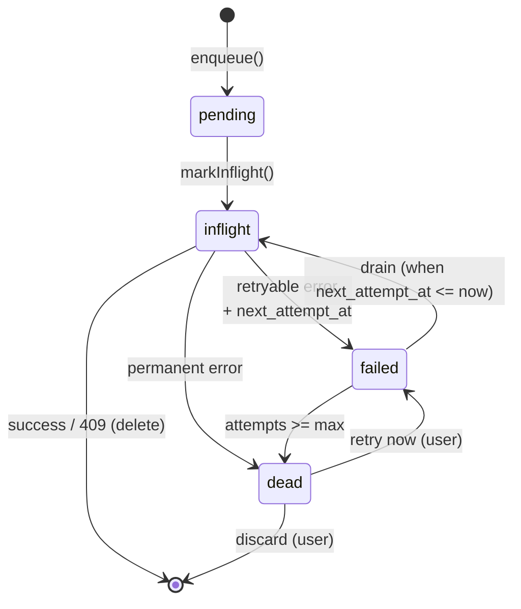
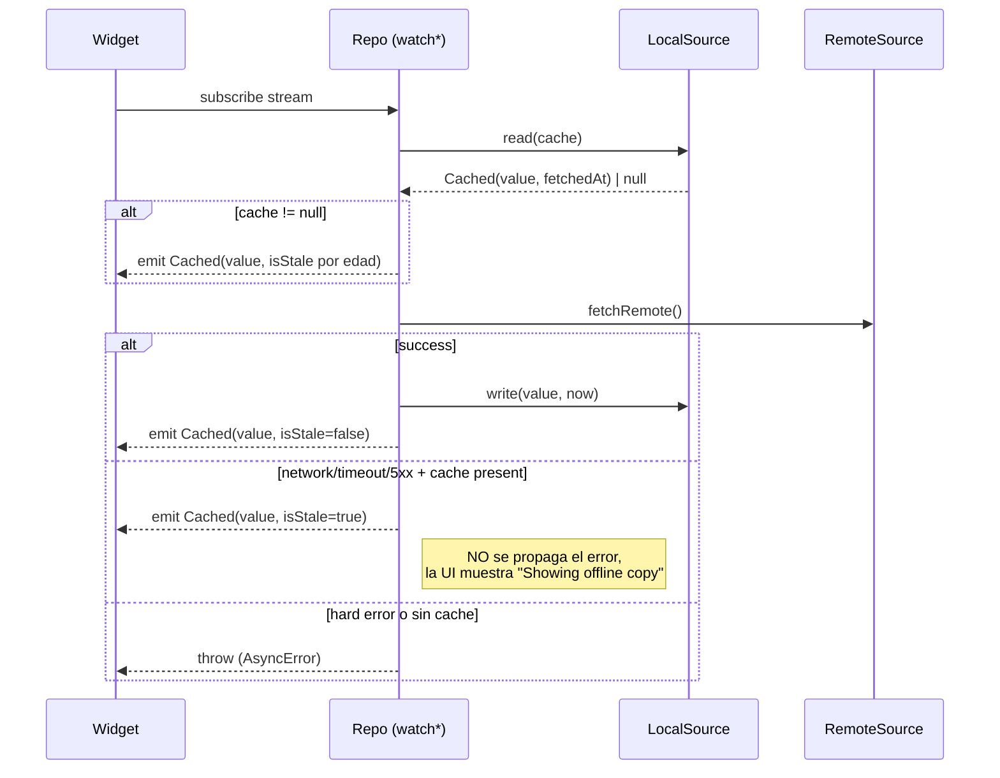
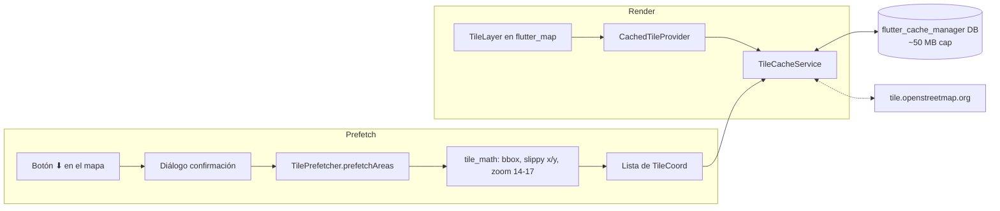
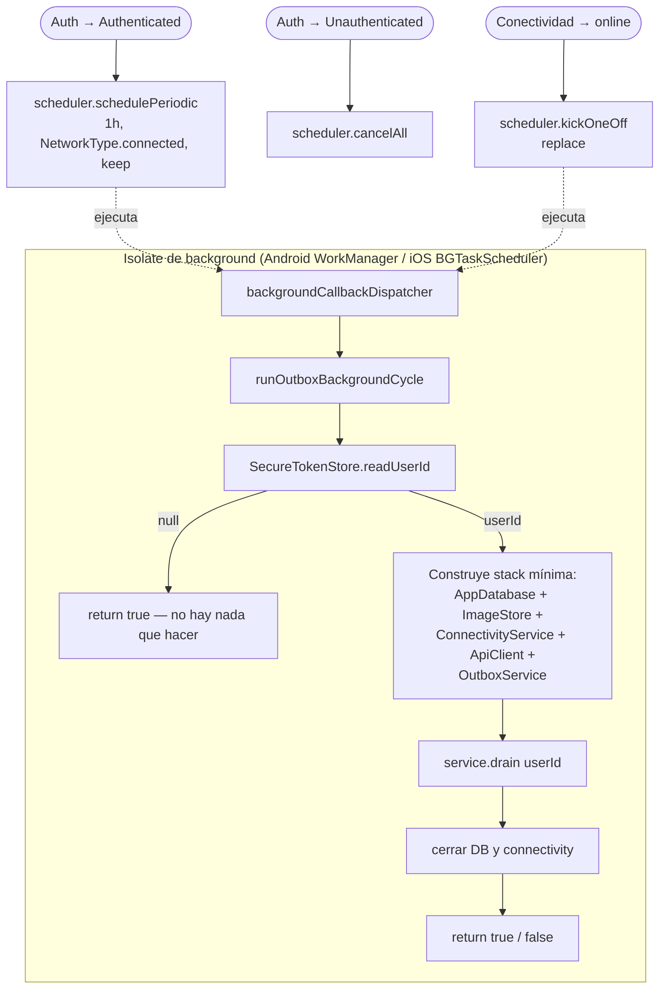
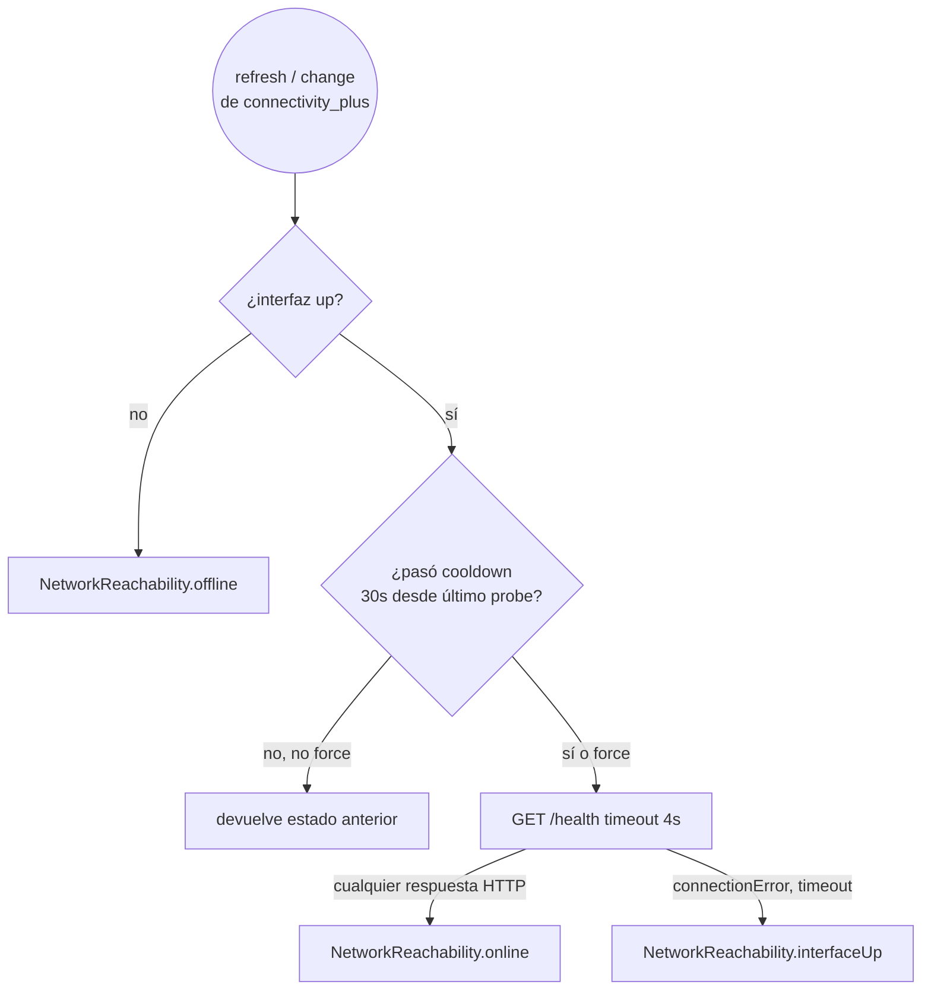

# Check‑ins offline en Rayuela Mobile

> Documento de "cómo funciona esto" del sistema offline de la app
> mobile. Si vas a tocar algo del flujo de check‑ins, leé esto antes
> de meter mano. El plan original con decisiones y trade‑offs está en
> [`OFFLINE_SYNC_PLAN.md`](./OFFLINE_SYNC_PLAN.md); acá contamos qué
> quedó construido y por qué se ve así.

Idioma: español. Comentarios en código siguen siendo inglés (consistencia
con el resto del repo).

---

## 1. Por qué existe esta feature

Los voluntarios de Rayuela trabajan en campo: parques, costas, barrios.
La conectividad allí es… variable. Antes de Phase 2, si el voluntario
salía a hacer un check‑in en un punto sin señal:

1. Iba al lugar, sacaba foto, apretaba **Enviar**.
2. La app intentaba subir la foto, fallaba, le mostraba un error.
3. El voluntario volvía al auto (o al café, o a casa) buscando red.
4. Tenía que **rehacer** el check‑in: nueva foto, nueva ubicación,
   nueva fecha — y los puntos no se contaban donde debían.

Phase 2 invierte esa experiencia: el voluntario aprieta **Enviar** una
sola vez. Si hay red, sale; si no hay, queda en cola y se manda solo
en cuanto haya señal. Ni la foto ni la ubicación se pierden si la app
muere o el teléfono se reinicia.

Aparte de los check‑ins, la migración trajo lecturas offline (caché
de proyectos, tareas, leaderboard), mapas pre‑descargados, e
idempotencia end‑to‑end para que un retry tras un timeout no genere
un check‑in duplicado.

---

## 2. La experiencia desde la app

Lo que ve el voluntario, en orden:

| Situación | Qué ve |
|---|---|
| Entra a un proyecto suscripto, ve la lista de tareas. | Pull‑to‑refresh + chip "Actualizado hace X" arriba. Si entró sin red, ve la copia local marcada como "Mostrando copia sin conexión". |
| Saca foto y aprieta Enviar **con red**. | Pantalla de recompensa de siempre, con puntos + insignias. |
| Saca foto y aprieta Enviar **sin red**. | Bajo el botón aparece un chip naranja "Sin conexión — lo enviaremos cuando vuelvas a tener red". Al apretar Enviar pasa a la pantalla **Pendiente** (panel `cloud_queue` + hora de captura) en lugar de la celebración. |
| Vuelve al Dashboard. | Aparece un banner "N check‑ins por enviar — Ver". El AppBar muestra un cloud‑off / sync / warning según el estado. |
| Recupera red (o reabre la app). | El drainer arranca solo y va vaciando la cola en orden FIFO. Las pildoras de estado de cada fila pasan de "Pendiente" → "Enviando…" → desaparece. |
| Algo falla y la fila queda muerta. | En **Ajustes → Datos pendientes**, el voluntario ve cada fila con `Reintentar ahora` / `Descartar`. |
| Vuelve a una zona sin señal pero ya había abierto el proyecto antes. | El mapa sigue funcionando si pre‑descargó las tiles (botón ⬇ en el mapa). Áreas, tareas y leaderboard se muestran desde caché. |

---

## 3. Arquitectura en una mirada



**Lectura rápida**: las pantallas hablan con los repos; los repos
hablan con remote sources (HTTP) y local sources (SQLite). El
`OutboxService` es la pieza nueva que decide entre enviar directo o
encolar y se encarga de drenar. La capa `core/sync` orquesta
conectividad, ciclo de vida del app, y tareas en background.

---

## 4. Componentes principales

| Componente | Responsabilidad |
|---|---|
| **`AppDatabase`** | Abre el SQLite con WAL + foreign keys + `synchronous=NORMAL`. Maneja migraciones versionadas. |
| **`OutboxDao`** | CRUD sobre `outbox_checkins` y `outbox_checkin_images`. Expone `nextEligible`, `markFailed/Dead`, `reclaimStaleInflight`. |
| **`ImageStore`** | Comprime y copia las fotos al sandbox de la app antes de encolar. `sweepOrphans` limpia carpetas sin fila. |
| **`CheckinsRepositoryImpl`** | Decide en cada `submitCheckin` si va directo o a cola. Devuelve `Accepted | Queued | Rejected`. |
| **`OutboxService`** | Drena la cola bajo un single-flight flag, aplica backoff con jitter, emite `SyncStatus` y `changes`. |
| **`OutboxSender` / `CheckinOutboxSender`** | Bridge entre `core/sync` y la feature: traduce `OutboxEntry` → `POST /checkin`. |
| **`OutboxLifecycle`** | Observer de `WidgetsBinding` + listener de conectividad. Llama `drain()` en `resumed` y al pasar a online. |
| **`ConnectivityService`** | Combina `connectivity_plus` con un probe a `GET /health`. Distingue `offline | interfaceUp | online`. |
| **`BackgroundSyncScheduler`** | Wrap de `workmanager` (Android `WorkManager` + iOS `BGTaskScheduler`). |
| **`Cached<T>` + `staleWhileRevalidate`** | Helper para lecturas offline‑first (proyectos, tareas, leaderboard). |
| **`TileCacheService` + `TilePrefetcher`** | Cache de tiles OSM y pre‑descarga on‑demand. |

---

## 5. ¿Qué pasa cuando el voluntario aprieta Enviar?



**Por qué chequeamos `pendingCount > 0`**: si el voluntario hizo dos
check‑ins offline y después salió online, no queremos que el tercero
salte la fila — eso rompe el orden FIFO y desbarata el orden temporal
percibido. Con cola pendiente, todo nuevo va a la cola.

**Idempotency key**: el id de la fila del outbox (UUID v4) viaja como
header `Idempotency-Key`. Si la fila se reintenta tras un timeout
donde el server *sí* recibió el check‑in pero la respuesta no llegó,
el segundo intento devuelve **200** (con header `X-Original-Resource:
<id>`) o **409**, y el drainer lo trata como éxito y borra la fila.
Cero duplicados.

---

## 6. Cómo drena la cola



Detalles a fijarse:

- **Flag de drenado**: `_draining` evita que dos triggers solapados
  manden la misma fila dos veces. Si un trigger llega mientras hay
  drain corriendo, hace early‑return; el drain en curso ya va a ver
  las filas nuevas en su próximo `nextEligible`.
- **Reclamo de `inflight` huérfanos**: si un drain anterior crasheó
  con una fila marcada `inflight`, la próxima vez pasa a `pending`
  (cutoff de 10 min). Sin esto, una fila quedaría atascada para siempre.
- **Backoff con jitter**: schedule fijo
  `[5s, 15s, 1m, 5m, 30m, 2h, 6h]` ± 15 % para que un parque de
  dispositivos volviendo online no haga thundering‑herd contra el
  backend. Tras el último escalón, la fila pasa a `dead`.
- **Por qué rompemos el loop al primer retryable**: respeto al
  servidor. Si una fila falla con 503, las siguientes probablemente
  también; mejor esperar al próximo trigger.

---

## 7. La fila vista como máquina de estados



`OutboxStatus` está documentado en `outbox_entry.dart`. El **único**
estado que el drainer transiciona automáticamente es `pending →
inflight → {ok, failed, dead}` y `failed → inflight`. `dead` solo se
mueve por acción del usuario (Reintentar / Descartar).

---

## 8. Almacenamiento local

### 8.1 SQLite (`AppDatabase`, schema v1)

```text
outbox_checkins             ── la cola
  id TEXT PK                 (UUID v4 = Idempotency-Key)
  user_id, project_id, task_id, task_type
  latitude, longitude, datetime_iso, client_captured_at
  notes
  status, attempt_count, next_attempt_at
  last_error_code, last_error_message
  created_at, updated_at
  + idx (user_id, status, next_attempt_at)
  + idx (project_id, created_at)

outbox_checkin_images        ── 1:N a outbox_checkins
  outbox_id, position PK
  file_path, byte_size, mime_type
  FK ON DELETE CASCADE → outbox_checkins(id)

cached_projects              ── 1 fila sentinel + N por proyecto
  user_id, project_id PK     (project_id == '__subscribed__' para la lista)
  payload_json, is_subscribed, fetched_at

cached_tasks
  user_id, project_id PK
  payload_json, fetched_at

cached_leaderboards
  user_id, project_id PK
  payload_json, fetched_at

cached_checkin_history       (reservada — no usada todavía)
```

**Por qué WAL + `synchronous=NORMAL`**: queremos que un crash mid‑write
no nos pierda la transacción anterior. WAL nos da escrituras atómicas
sin `fsync` por commit; `NORMAL` baja la latencia con un
trade‑off aceptable (perdés la última transacción solo si el dispositivo
muere de repente — no si la app crashea).

**Por qué `payload_json` y no columnas**: el shape de la cache está
desacoplado del shape de los DTOs de red. Si mañana el backend mueve
un campo, no migramos el SQLite — solo refactorizamos los
encoders/decoders en cada `LocalSource`. Costo: no podemos hacer
queries SQL sobre los campos del payload, pero las pantallas siempre
piden "todo el proyecto" o "todas las tareas", así que no nos hace
falta.

### 8.2 Imágenes en disco

Layout dentro de `getApplicationSupportDirectory()/outbox/`:

```text
outbox/
  <outboxId>/
    0.jpg          # foto comprimida 1600px JPEG q80
    1.jpg
    2.jpg
```

`getApplicationSupportDirectory()` es **persistente** (no se purga
por el OS como `getTemporaryDirectory()`). Esto es importante: si el
voluntario captura la foto offline, va al subte 30 minutos, y vuelve,
las imágenes siguen ahí.

`ImageStore.sweepOrphans(knownIds)` corre al bootstrap y borra
carpetas que ya no tienen fila (típicamente porque el sender exitoso
borró la fila pero crasheó antes de borrar la carpeta).

### 8.3 Lecturas offline (SWR)

El patrón `staleWhileRevalidate` (en `core/cache/`) corre así:



Las pantallas dibujan un `LastUpdatedChip` con `fetchedAt` y `isStale`
para que el voluntario sepa qué tan vieja es la copia.

---

## 9. Mapas offline



Cosas a tener en cuenta:

- Cap **2500 tiles** por proyecto (≈ 30 MB). Si el bbox es muy
  grande, el prefetch aborta con `TilePrefetchTooLarge` antes de
  pegar al server.
- **4 requests concurrentes** — política polite con OSM
  (`User‑Agent` configurado).
- El cache es **siempre** activo: navegando un mapa con red ya
  warmea el cache para uso offline posterior. El botón solo es
  conveniente para "ahora voy al campo, dejame todo descargado".

---

## 10. Background sync

Para que la cola drene incluso con la app cerrada:



El isolate de background **no** comparte estado con la UI: ni
Riverpod, ni el cache de tiles, ni los providers. Cada ciclo abre su
propia conexión a SQLite (WAL es seguro entre isolates) y la cierra.
El secret store de tokens funciona igual.

Configuración nativa en
[`BACKGROUND_SYNC_SETUP.md`](./BACKGROUND_SYNC_SETUP.md).

---

## 11. El probe de salud

`connectivity_plus` solo nos dice si el OS cree que hay interfaz —
no si esa interfaz tiene tráfico real. Captive portals, VPN sin
conectar, hotspot WiFi sin WAN: todos reportan "conectado" pero
todas las requests fallan. Por eso layer adicional:



`isOnlineForReal()` es lo que el drainer mira antes de empezar a
mandar. `interfaceUp` es el caso "tenés WiFi pero el backend no
responde" — la UI muestra "sin conexión" pero más suave (no es
catastrófico).

---

## 12. Contratos del backend que cambiaron

Ver `OFFLINE_SYNC_PLAN.md` §8 para detalles. Resumen:

- `POST /checkin` acepta header `Idempotency-Key` (UUID v4). Mongo
  collection `CheckinIdempotency` con TTL 7 días. Replay con mismo
  user → 200 + header `X-Original-Resource`. Conflict cross‑user → 409.
- `POST /checkin` con `FilesInterceptor`:
  - `limits.fileSize = 5 MB`. Multer error → mapeado a 413 por
    `MulterExceptionFilter`.
  - `fileFilter` rechaza MIME fuera de `image/{jpeg,png,webp}` con 400.
- `GET /health` (sin auth) devuelve `{ ok: true, ts }`. `HEAD /health`
  devuelve 204. `Cache-Control: no-store`.

---

## 13. Cómo verificar que funciona

### 13.1 Smoke test manual

1. Login con un usuario y suscribirse a un proyecto.
2. Activar **modo avión**.
3. Ir a un task, sacar foto, apretar **Enviar**.
4. Verás el chip "Sin conexión" + pantalla **Pendiente** + banner en
   Dashboard.
5. Cerrar la app por completo (swipe).
6. Desactivar modo avión, esperar ~10 s.
7. Reabrir la app: el banner debería desaparecer en segundos y la
   fila aparecer en el historial sincronizado.

### 13.2 Tests automatizados

```bash
flutter test                       # toda la suite
flutter test test/core/sync        # outbox + connectivity + DB
flutter test test/core/cache       # SWR helper
flutter test test/core/maps        # tile math + prefetcher
```

Backend:

```bash
cd ../rayuela-NodeBackend
npm test
```

Cobertura clave:

| Caso | Test |
|---|---|
| `nextEligible` respeta FIFO + `next_attempt_at` | `outbox_dao_test.dart` |
| Drainer hace cascada `Succeeded → AlreadyExists → Retryable → Permanent` | `outbox_service_test.dart` |
| ImageStore rollback ante fallo | `image_store_test.dart` |
| ConnectivityService promueve `interfaceUp → online` cuando probe ok | `connectivity_service_test.dart` |
| SWR helper devuelve cache + remote + cache‑stale en error blando | `stale_while_revalidate_test.dart` |
| Idempotency replay devuelve 200 con `replayed: true` | `checkin.service.spec.ts` |
| Conflict cross‑user → 409 | `checkin.service.spec.ts` |

### 13.3 En dispositivo real

Android:

```bash
adb shell dumpsys jobscheduler | grep com.rayuela
# para ver las tareas registradas, y forzarlas con:
adb shell cmd jobscheduler run -f com.rayuela.mobile <jobId>
```

iOS:

```
e -l objc -- (void)[[BGTaskScheduler sharedScheduler]
  _simulateLaunchForTaskWithIdentifier:@"com.rayuela.sync.periodic"]
```

---

## 14. Limitaciones conocidas y trabajo futuro

| Limitación | Comentario |
|---|---|
| iOS BGTaskScheduler es "best‑effort". | El sistema decide cuándo correr. Foreground triggers (`resumed`, connectivity) son los reales workhorses. |
| El reloj del cliente puede estar mal. | Enviamos `clientCapturedAt` además de `datetime` para que el backend pueda detectar drift, pero todavía no implementamos la advertencia al usuario. |
| El backend devuelve `gameStatus` vacío en replays. | Decidido para no doble‑contar puntos. La UI del drainer no lo necesita; si en el futuro queremos mostrar la recompensa post‑replay, hay que persistir el envelope original. |
| Mapas offline no tienen UI de progreso global. | El snackbar muestra %, pero no hay vista de "tengo X MB descargados de los Y proyectos". `ImageStore.totalBytesUsed()` ya da el dato; falta la pantalla. |
| Conflictos de datos cruzados. | El único write offline son inserts de check‑ins. No tenemos updates ni deletes offline, así que no hay merge — si esto cambia, hay que diseñar resolución. |

Roadmap sugerido (no comprometido):

- Push notifications para que el voluntario sepa cuándo se sincronizó.
- Editar un check‑in `dead` (cambiar foto / taskType) en lugar de
  solo descartar.
- Pantalla "Espacio usado" con desglose (cola, mapas, caches).
- Telemetría agregable: contadores `outbox_enqueued`,
  `outbox_sent_ok`, `outbox_sent_fail`, `tile_prefetch_done` que se
  manden a Sentry/Crashlytics cuando lo wireamos.

---

## 15. Mapa de archivos (TL;DR)

```text
lib/
  core/
    cache/
      cached_value.dart                 Cached<T>
      json_cache_table.dart             Wrapper sobre cached_*
      stale_while_revalidate.dart       SWR helper

    maps/
      tile_cache_service.dart
      cached_tile_provider.dart
      tile_math.dart                    Slippy-map math
      tile_prefetcher.dart

    sync/
      app_database.dart                 SQLite open + migrations
      connectivity_service.dart
      outbox/
        outbox_entry.dart               Entidad + OutboxStatus
        outbox_dao.dart
        outbox_service.dart             enqueue + drain
        outbox_sender.dart              Bridge interface + classifyAppException
        backoff_strategy.dart
        outbox_lifecycle.dart           Resume + connectivity → drain()
        sync_status.dart
        background_sync.dart            Dispatcher entry-point
        background_sync_scheduler.dart  WorkManager / BGTaskScheduler facade

    storage/
      image_store.dart
      secure_token_store.dart           (existente)

  features/checkin/
    domain/entities/checkin_submission_outcome.dart   Accepted | Queued | Rejected
    data/sources/checkin_outbox_sender.dart           Implementación de OutboxSender
    presentation/
      providers/outbox_providers.dart
      widgets/{pending_checkin_tile.dart, outbox_badge.dart}
      screens/pending_data_screen.dart

docs/
  OFFLINE_SYNC_PLAN.md           Plan original con decisiones
  OFFLINE_CHECKINS.md            Este documento
  BACKGROUND_SYNC_SETUP.md       Configuración nativa Android/iOS
  CHANGELOG_OFFLINE.md           Notas de release de Phase 2
```
